# [CerberusVision](https://github.com/mecik-arda/CerberusVision)

[](https://learn.microsoft.com/windows/wsl/)

> Bu proje, Soft İş Çözümleri bünyesinde hazırlanmış bir staj projesidir.
>
> **Oluşturulma Tarihi:** 17.07.2026
>
> **WSL-native:** Kaynak kod, Git işlemleri, Python ortamı, modeller ve sunucu
> doğrudan Ubuntu dosya sistemi içinde çalışır; Windows tarafında ikinci bir
> kaynak kopyası veya dosya senkronizasyonu gerekmez.

CerberusVision, konşimento talimatı (Shipping Instruction) belgelerini yerel
çıkarım hattı ve Qwen modeliyle işleyip DCSA tabanlı XML üreten bir FastAPI
uygulamasıdır. PDF, DOCX, XML, PNG ve JPEG desteklenir; arayüz tekil veya toplu yüklemede
(Batch Upload) en fazla 50 belgeyi GPU dostu sıralı kuyrukla işler. Ana ve tek çalışma ortamı
WSL2/Ubuntu'dur; DeepSeek yalnızca isteğe bağlı, kısa ve salt-okunur bir risk
hakemi olarak kullanılır.

```mermaid
graph LR
    A["📦 Toplu / Tekil Belge Yükleme<br/>PDF / DOCX / PNG / JPEG (Max 50)"] --> B["🛡️ Eager Validation & Ön Kontrol<br/>İmza, Boyut & Uyum Doğrulama"]
    B --> C["👁️ Florence-2 VLM + PaddleOCR<br/>Mizanpaj & Tablo Tespiti"]
    C --> D["📐 Akıllı Bölge Ayrıştırma<br/>Üst / Orta / Alt Bölge"]
    D --> E["🧩 3 Aşamalı Modüler Çıkarım<br/>Qwen2.5 / LoRA OpenVINO"]
    E --> F["🛠️ Deterministik Kural Motoru<br/>Konteyner ISO / Ağırlık-CBM / Rol & Adres"]
    F --> G["🛡️ Yerel Risk Kontrolleri<br/>Zorunlu Alan & Şema Denetimi"]
    G -.->|Gerekirse| H["☁️ Kısa DeepSeek Yorumu<br/>Salt-Okunur Hakem"]
    G --> I["⚙️ DCSA XML & Audit Oluşturucu"]
    H -.-> I
    I --> J["🖥️ Web Arayüzü & Canlı SSE İlerleme"]
    I --> K["📦 Toplu Audit ZIP İndirme<br/>XML + Audit JSON + Hata Raporu"]
    I -.->|Otomatik / Tetik| L["🌐 Webhook ERP Entegrasyonu"]

    style A fill:#f8f9fa,stroke:#adb5bd,stroke-width:2px,color:#212529
    style B fill:#fff4e6,stroke:#ffa94d,stroke-width:2px,color:#212529
    style C fill:#e7f5ff,stroke:#74c0fc,stroke-width:2px,color:#212529
    style D fill:#e7f5ff,stroke:#74c0fc,stroke-width:2px,color:#212529
    style E fill:#f3f0ff,stroke:#b197fc,stroke-width:2px,color:#212529
    style F fill:#ebfbee,stroke:#8ce99a,stroke-width:2px,color:#212529
    style G fill:#fff4e6,stroke:#ffa94d,stroke-width:2px,color:#212529
    style H fill:#f3f0ff,stroke:#b197fc,stroke-width:2px,color:#212529,stroke-dasharray: 5 5
    style I fill:#f8f9fa,stroke:#adb5bd,stroke-width:2px,color:#212529
    style J fill:#e6fcf5,stroke:#20c997,stroke-width:2px,color:#212529
    style K fill:#e6fcf5,stroke:#20c997,stroke-width:2px,color:#212529
    style L fill:#e6fcf5,stroke:#20c997,stroke-width:2px,color:#212529,stroke-dasharray: 5 5
```



DeepSeek belge verisini düzeltmez, alan doldurmaz ve ikinci bir Shipping
Instruction üretmez. Nihai JSON/XML her zaman yerel model çıktısından üretilir.

## Doğrulanmış çalışma ortamı

- WSL2 dağıtımı: `Ubuntu` (Ubuntu 26.04 LTS)
- Tek kaynak ve çalışma dizini: `~/projects/CerberusVision`
- Python: `3.12.13` (`uv` tarafından yönetilir)
- OpenVINO / OpenVINO GenAI: `2025.4`
- GPU: Intel Arc 140V iGPU; OpenVINO aygıtları `CPU`, `GPU`
- Test sonucu: `179 passed` (Ubuntu WSL2)
- Benchmark doğruluk skoru: `%80.21` (Temel model: `%69.40`, Net artış: `+%10.81` puan)

Kod düzenleme, Git işlemleri, testler ve sunucu doğrudan WSL ext4 dosya sistemi
içinde yürütülür. Windows tarafında ikinci bir kaynak kopya veya senkronizasyon
adımı kullanılmaz.

## Arayüz dili ve tema

Web arayüzü varsayılan olarak Türkçe açılır. Üst menüdeki `TR / EN`
seçicisinden İngilizceye geçilebilir. Dil tercihi tarayıcıda saklanır ve sonraki
açılışlarda korunur; yükleme, işlem durumu, denetim, doğrulama ve dinamik tablo
mesajları da seçilen dile uyarlanır.

Belge yüklenmeden önce belge dili ve XML içerik dili ayrı ayrı `Türkçe` veya
`İngilizce` seçilir. Belge dili PaddleOCR profilini ve Qwen'in kaynak etiketleri
yorumlama biçimini belirler. XML içerik dili yalnızca açıklama ve not gibi
çevrilebilir değerleri yönlendirir; şirket adları, adresler, limanlar, kimlikler,
kodlar ve sayılar değiştirilmez. DCSA XML eleman adları XSD uyumluluğu için her
zaman standart biçiminde kalır.

Ay simgeli tema düğmesi açık ve koyu tema arasında geçiş yapar. İlk açılışta
işletim sistemi tercihi kullanılır; kullanıcı bir tema seçtiğinde bu tercih kalıcı
hale gelir.

Yükleme alanı PDF, DOCX, XML, PNG ve JPEG dosyalarını çoklu seçime veya
sürükle-bırak işlemine kabul eder. Dosya uzantısına ek olarak PDF/PNG/JPEG imzası,
DOCX paket yapısı ve güvenli XML ayrıştırması sunucuda doğrulanır. PDF ve görseller
OCR'a, DOCX/XML metni doğrudan yerel modele gider. Kuyruk belgeleri sırayla
işlediği için tek GPU üzerinde eşzamanlı model yükü oluşturmaz; her dosyanın durumu
arayüzde ayrı gösterilir.

Üst menüdeki arama düğmesi form alanlarını ve ana bölümleri bulup ilgili
kontrole odaklanır. Bildirim paneli son işlem durumunu, profil paneli ise etkin dil,
tema ve oturum kimliğini gösterir. PDF araç çubuğu; oturumluk belge bağlantısı
kopyalama, `%100 / %125 / %150 / %200` yakınlaştırma, tam ekran, sayfa sayımı,
sayfa düğmeleri ve önceki/sonraki gezinme işlevlerini sunar. Sonuç eylemleri,
gerekli veri oluşana kadar açıkça devre dışı tutulur.

Arama düğmesinin yanındaki terminal düğmesi Python, Uvicorn, HTTP ve belge işleme
olaylarını sunucudan SSE ile canlı gösterir. Sunucu ve tarayıcı en fazla 500 kaydı
tutar; bağlantı koptuğunda son olay kimliğinden devam eder. Panelde otomatik
kaydırma ve güvenli tampon temizleme işlevleri bulunur. Log endpoint'leri Cerberus
API anahtarı korumasını kullanır; Bearer değerleri, API anahtarları, tokenlar ve
secret kalıpları tarayıcıya gönderilmeden önce maskelenir.

Arama simgesinin yanındaki ayarlar paneli genişletilmiş çıkarım kontrolleri sunar:
- **Çıkarım Motoru:** 3 Aşamalı Modüler Çıkarım veya Tek Geçiş seçenekleri.
- **Mizanpaj Algoritması:** Florence-2 VLM tabanlı Hibrit mod veya Y-Oranı (statik).
- **LoRA İnce Ayar:** Kullanıcı tarafından eğitilmiş özel adaptörlerin (models/) seçimi.
- **Cihaz & Model:** Etkin OpenVINO modeli, GPU/CPU aygıtı ve limitler.

Panel; proje `models/` dizini, `~/models`, Hugging Face önbelleği ve Ollama
manifestlerinde bulunan WSL modellerini listeler ve etkin modeli işaretler. Cerberus
sunucu API anahtarı yalnızca tarayıcı sekmesinin `sessionStorage` alanında, DeepSeek
anahtarı ise yalnızca çalışan FastAPI sürecinin belleğinde tutulur. DeepSeek denetim
modu ve risk eşiği panelden anlık değiştirilebilir.

Seçili yerel model, mizanpaj algoritması, LoRA ayarları, bölge oranları, DeepSeek
denetim modu, tema ve dil tercihleri `.cerberus-settings.json` içinde kalıcı tutulur.
DeepSeek ve Cerberus API anahtarları bu dosyaya hiçbir zaman yazılmaz.

Tailwind sınıfları geliştirme sırasında derlenip `static/app.css` içinde tutulur.
Arayüz çalışma zamanında Tailwind CDN veya Google Fonts bağlantısı kurmaz. CSS'i
yeniden üretmek için Node.js bulunan geliştirme ortamında `pnpm install` ve
`pnpm run build:css` komutları kullanılabilir.

## İngilizce belge keşif aracı

`scripts/find_shipping_documents.py`, Shipping Instruction ve Bill of Lading
örneklerini hedefli İngilizce sorgularla arar. Resmî Brave Search API ana sağlayıcıdır;
mevcut müşteriler için Google Custom Search JSON API de desteklenir. Google sonuç
sayfalarının HTML'i kazınmaz. Varsayılan sorgular PDF, PNG ve JPG belgelerde
`shipping instruction`, `bill of lading`, liman, konteyner, navlun, brüt ağırlık ve
HS code terimlerine odaklanır.

[Google'ın resmî duyurusuna](https://developers.google.com/custom-search/v1/overview)
göre Custom Search JSON API yeni müşterilere kapalıdır ve mevcut müşteriler için
1 Ocak 2027'de sonlandırılacaktır. Bu nedenle yeni kurulumlarda
[Brave Search API](https://api-dashboard.search.brave.com/app/documentation/web-search/get-started)
önerilir; Google sağlayıcısı geçiş dönemi uyumluluğu için korunur.

Yerel hat dosya imzasını, boyutu, okunabilirliği, belge geometrisini, anahtar kelime
kapsamını ve ilk İngilizce sinyalini denetler. DeepSeek yalnızca iki karar verir:
belgenin Shipping Instruction/Bill of Lading konusuyla ilgili olup olmadığı ve
İngilizce olup olmadığı. Kalite skoru vermez; metni düzeltmez, alan çıkarmaz,
tamamlamaz veya yeni veri üretmez. Her iki DeepSeek kararı da olumlu olmayan belge
`accepted` dizinine alınmaz.

WSL içindeki `.env` için önerilen ayar:

```dotenv
DOCUMENT_SEARCH_PROVIDER=brave
BRAVE_SEARCH_API_KEY=
DEEPSEEK_API_KEY=
DOCUMENT_SEARCH_OUTPUT_DIR=veriler/discovered
```

Google Custom Search JSON API erişimi bulunan mevcut hesaplar için:

```dotenv
DOCUMENT_SEARCH_PROVIDER=google
GOOGLE_SEARCH_API_KEY=
GOOGLE_SEARCH_ENGINE_ID=
```

Kullanım:

```bash
cd ~/projects/CerberusVision
./.venv/bin/python scripts/find_shipping_documents.py --print-queries
./.venv/bin/python scripts/find_shipping_documents.py --max-results 20
./.venv/bin/python scripts/find_shipping_documents.py --local-only --max-results 20
./.venv/bin/python scripts/find_shipping_documents.py \
  --query 'filetype:pdf "bill of lading" "port of loading" "port of discharge"'
```

Normal çalışmada kabul edilen dosyalar `veriler/discovered/accepted`, denetim izi
`veriler/discovered/manifest.jsonl` altına yazılır. `--local-only` DeepSeek'i hiç
çağırmaz ve yerel filtreden geçenleri `pending_review` altında bekletir; bu dosyalar
kabul edilmiş veri sayılmaz. Kaynak adresi ve SHA-256 özeti manifestte tutulur,
aynı içerik yeniden indirilmez. Üçüncü taraf belgelerin kullanım/lisans hakkı arama
sonucuyla birlikte verilmiş sayılmaz; veri kümesine almadan önce kaynak koşulları
kontrol edilmelidir.

## Yerel model

CerberusVision tek genel amaçlı yerel model kullanır: Qwen2.5-7B-Instruct INT4
OpenVINO. Varsayılan aygıt Intel Arc 140V GPU'dur. İkinci bir genel amaçlı model
aynı anda veya alternatif kalite profili olarak çalıştırılmaz; bellek ve bakım
bütçesi 7B çıkarım, deterministik normalizasyon ve gerektiğinde yine aynı modelle
yapılan düşük güvenli alan doğrulamasına ayrılır.

Model seçici yalnızca doğrudan çalıştırılabilen OpenVINO dizinlerini etkinleştirir.
Model değiştirildiğinde mevcut çıkarım hattı sıfırlanır ve yeni model ilk istekte
yüklenir. Tüm model sonuçları kullanıcı onayından geçmelidir.

### Qwen-2.5 LoRA Eğitimi ve Benchmark Değerlendirmesi

Modelin konşimento talimatı (Shipping Instruction) belgelerindeki JSON ayrıştırma başarısını artırmak amacıyla Unsloth kütüphanesi ile Google Colab (A100 GPU) ortamında 4-bit LoRA (PEFT) ince ayarı uygulanmıştır:

- **Eğitim Veri Seti (`veriler/si_training.jsonl`):** Veri çoğaltma (data augmentation) ve gürültü ekleme yöntemleriyle 231 adede çıkarılmış zorlu konşimento metinleri.
- **Eğitim Paketi:** `notebooks/CerberusVision_Qwen_LoRA.ipynb` notebook'u ve Google Drive yüklemesine hazır `CerberusVision_Colab_Egitim_Seti/` paketi.
- **Eğitim Yapılandırması:** Unsloth bellek optimizasyonu, 4-bit kuantizasyon, veri paketleme (`packing=True`), 20 adımda bir otomatik Google Drive yedekleme ve kesinti sonrası otomatik devam etme (`resume_from_checkpoint`).
- **Model Adaptörü:** Eğitilen LoRA ağırlıkları projedeki `models/qwen2.5-7b-cerberus-lora/` dizinine entegre edilmiştir.
- **Benchmark Doğrulama Sonuçları (`scripts/evaluate_qwen.py`):**
  - **Test Edilen Doküman Sayısı:** 12 Adet Karmaşık Konşimento
  - **Genel Doğruluk Oranı (Accuracy):** %80.21 (Önceki baseline: %69.40, Net İyileşme: +%10.81 puan / %15.57 bağıl artış)
  - **Toplam Denetlenen Alan Sayısı:** 480 Alan
  - **Doğru Çıkarılan Alan:** 385 / 480
  - **Eksik Alan Oranı (Missing):** %3.3 (16 alan)

## İlk WSL2 kurulumu

### 1. WSL bellek profilini uygula

Projedeki [`.wslconfig.example`](.wslconfig.example) dosyası 32 GiB RAM'li bu
makine için WSL'ye 24 GiB RAM ve 8 GiB swap ayırır. Ayar tüm WSL2 dağıtımlarını
etkiler.

PowerShell:

```powershell
Copy-Item .wslconfig.example $env:USERPROFILE\.wslconfig
wsl --shutdown
```

Bu dosyanın biçimi ve varsayılanlar için Microsoft'un
[WSL gelişmiş ayarlar belgesine](https://learn.microsoft.com/windows/wsl/wsl-config)
bakılabilir.

### 2. Projeyi WSL dosya sistemine klonla

Ubuntu terminali:

```bash
mkdir -p ~/projects
git clone https://github.com/mecik-arda/CerberusVision.git ~/projects/CerberusVision
cd ~/projects/CerberusVision
```

Mevcut kurulum zaten `~/projects/CerberusVision` altındaysa yeniden
klonlama gerekmez. `./scripts/wsl_sync.sh` artık Windows'tan dosya kopyalamaz;
yalnızca geçerli dizinin WSL2 içinde, Linux home altında ve Git geçmişiyle birlikte
çalıştığını doğrular.

### 3. VS Code'u WSL penceresinde aç

Ubuntu terminalinde proje dizininden:

```bash
code .
```

VS Code'un sol alt köşesinde `WSL: Ubuntu` görünmelidir. İlk kullanımda Windows
tarafındaki VS Code'a
[WSL uzantısını](https://marketplace.visualstudio.com/items?itemName=ms-vscode-remote.remote-wsl)
kurun. Windows klasörünü ayrı bir çalışma alanı olarak açmayın; terminal, Git,
Python ve eklentiler WSL penceresinde çalışmalıdır.

### 4. Python ve bağımlılıkları kur

```bash
cd ~/projects/CerberusVision
./scripts/wsl_setup.sh
```

Betik kullanıcı hesabına sabitlenmiş `uv 0.11.28` ve yönetilen Python 3.12 kurar;
sistem Python'una ve `apt` paketlerine dokunmaz. Tekrar çalıştırılabilir ve mevcut
`.venv` ortamını koruyarak bağımlılıkları günceller.

### 5. Yerel GPU modelini indir

```bash
./scripts/wsl_model_setup.sh
```

Varsayılan depo
[`OpenVINO/Qwen2.5-7B-Instruct-int4-ov`](https://huggingface.co/OpenVINO/Qwen2.5-7B-Instruct-int4-ov)
ve hedef `models/Qwen-2.5-7B-Instruct-INT4` dizinidir.

### 6. Model profilini doğrula

```bash
./scripts/wsl_profile.sh gpu
./scripts/wsl_profile.sh show
```

Profil değişikliğinden sonra çalışan sunucuyu yeniden başlatın.

## Çalıştırma

```bash
cd ~/projects/CerberusVision
./scripts/wsl_run.sh
```

Tarayıcı: `http://localhost:8000`

Sunucu `.env` dosyasını yükler ve varsayılan olarak yalnızca
`127.0.0.1:8000` üzerinde çalışır. Portu geçici değiştirmek için:

```bash
CERBERUS_PORT=8080 ./scripts/wsl_run.sh
```

Uzak ağ erişimi gerekiyorsa güçlü bir API anahtarı zorunludur:

```dotenv
CERBERUS_HOST=0.0.0.0
CERBERUS_API_KEY=uzun-rastgele-bir-deger
```

`wsl_run.sh`, loopback dışı adreste anahtar olmadan başlamayı reddeder. Web
arayüzü API HTTP 401 döndürdüğünde anahtarı ister ve yalnızca geçerli tarayıcı
sekmesinin `sessionStorage` alanında tutar. API istemcileri
`Authorization: Bearer <anahtar>` veya `X-Cerberus-Api-Key` başlığını kullanabilir.
Yüklemeler IP başına kayan zaman penceresiyle ve eşzamanlı aktif işlem kotasıyla
sınırlanır.

## Doğrulama komutları

```bash
# Otomatik testler
./.venv/bin/python -m pytest -q

# Paket ve OpenVINO aygıt kontrolü
./.venv/bin/python scripts/wsl_smoke.py --require-model

# Modeli gerçekten yükle ve kısa token üret
./.venv/bin/python scripts/wsl_smoke.py --require-model --probe-model

# Gerçek PDF OCR denetimi
./.venv/bin/python scripts/wsl_smoke.py --pdf konsimentotalimatornek3s.pdf

# FastAPI readiness ve tam PDF/SSE işlem hattı
./scripts/wsl_api_smoke.sh --require-ready --pdf konsimentotalimatornek3s.pdf

# GPU özellikleri ve bellek sınırları
./.venv/bin/python scripts/wsl_gpu_info.py
```

`/health`, model yolu ve seçili OpenVINO aygıtı hazırsa HTTP 200; eksikse ayrıntılı
kontrol raporuyla HTTP 503 döndürür.

## DeepSeek kısa risk denetimi

Varsayılan mod `risk`, eşik `30`'dur. Önce ücretsiz yerel kontroller çalışır.
DeepSeek'e tam OCR veya tam JSON gönderilmez; yalnızca bulgular, ilgili kritik
değerler ve en fazla 2500 karakterlik seçilmiş OCR satırları gönderilir.

`.env`:

```dotenv
DEEPSEEK_API_KEY=
DEEPSEEK_BASE_URL=https://api.deepseek.com
DEEPSEEK_REVIEW_MODE=risk
DEEPSEEK_RISK_THRESHOLD=30
DEEPSEEK_MAX_OCR_EXCERPT_CHARS=2500
```

Modlar:

- `off`: Bulut denetimi tamamen kapalıdır.
- `manual`: Yalnızca kullanıcı endpoint/CLI seçeneğiyle çalışır.
- `risk`: Yerel risk eşik veya üstündeyse otomatik çalışır.
- `always`: Her belgede kısa denetim çalışır.

DeepSeek hatası yerel JSON/XML üretimini durdurmaz. Kullanıcı formu değiştirdiğinde
eski bulut skoru geçersizleştirilir ve yeni veri otomatik olarak buluta gönderilmez.

Audit CLI:

```bash
# Yerel model + yerel risk politikası
./.venv/bin/python scripts/api_compare.py \
  --ocr-text logs/SESSION_ID/ocr_layout_text.txt

# Açıkça tek seferlik kısa bulut yorumu iste
./.venv/bin/python scripts/api_compare.py \
  --pdf uploads/sample.pdf --cloud-review --output audit_report.json
```

## Ortam değişkenleri

| Değişken | WSL varsayılanı | Açıklama |
|---|---|---|
| `QWEN_MODEL_PATH` | `.../Qwen-2.5-7B-Instruct-INT4` | Etkin OpenVINO model dizini |
| `OPENVINO_DEVICE` | `GPU` | `GPU` veya `CPU` |
| `OPENVINO_CACHE_DIR` | `.openvino_cache` | Derlenmiş OpenVINO önbelleği |
| `OPENVINO_KV_CACHE_PRECISION` | `u8` | Daha düşük KV-cache bellek kullanımı |
| `SSE_TIMEOUT_SECONDS` | `1800` | Uzun yerel çıkarım için SSE bekleme süresi |
| `CERBERUS_HOST` | `127.0.0.1` | Uvicorn dinleme adresi |
| `CERBERUS_API_KEY` | boş | Loopback dışı erişimde zorunlu Bearer/API anahtarı |
| `UPLOAD_RATE_LIMIT` | `5` | Zaman penceresinde IP başına yükleme sınırı |
| `UPLOAD_RATE_WINDOW_SECONDS` | `60` | Yükleme hız sınırı penceresi |
| `MAX_ACTIVE_PIPELINES` | `2` | Aynı anda kabul edilen işlem hattı sayısı |
| `STREAM_QUEUE_MAX_SIZE` | `20` | Bellekte tutulabilecek SSE kuyruğu üst sınırı |
| `STREAM_QUEUE_TTL_SECONDS` | `300` | Bağlanılmayan tamamlanmış SSE kuyruğu ömrü |
| `LOG_RETENTION_DAYS` | `30` | Audit oturumlarının otomatik saklama süresi |
| `OCR_LANG` | `en` | PaddleOCR dil profili; belge kümesine göre değiştirilebilir |
| `DEEPSEEK_API_KEY` | boş | Opsiyonel kısa bulut denetimi |
| `DEEPSEEK_REVIEW_MODE` | `risk` | `off`, `manual`, `risk`, `always` |
| `DEEPSEEK_RISK_THRESHOLD` | `30` | Otomatik kısa denetim eşiği |
| `DEEPSEEK_MAX_OCR_EXCERPT_CHARS` | `2500` | Seçilmiş OCR metni üst sınırı |
| `DOCUMENT_SEARCH_PROVIDER` | `auto` | `brave`, mevcut hesaplar için `google` veya otomatik seçim |
| `BRAVE_SEARCH_API_KEY` | boş | Brave Search API anahtarı |
| `GOOGLE_SEARCH_API_KEY` | boş | Mevcut Google Custom Search JSON API anahtarı |
| `GOOGLE_SEARCH_ENGINE_ID` | boş | Google Programmable Search Engine kimliği |
| `DOCUMENT_SEARCH_OUTPUT_DIR` | `veriler/discovered` | Kabul, bekleme ve manifest çıktı kökü |
| `DOCUMENT_SEARCH_MAX_RESULTS` | `20` | Bir çalıştırmada incelenecek azami aday |

## API

| Method | Path | Açıklama |
|---|---|---|
| `POST` | `/api/upload` | En fazla 50 MB PDF/DOCX/XML/PNG/JPEG yükler ve session ID döndürür |
| `POST` | `/api/upload-and-stream` | Desteklenen belgeyi yükler ve SSE durum akışını başlatır |
| `POST` | `/api/batch/upload` | En fazla 50 belgeyi doğrulayıp kuyruğa alır ve `batch_id` döndürür |
| `GET` | `/api/batch/{batch_id}/status` | Toplu işlemin anlık genel ve dosya seviyesindeki durumunu döndürür |
| `GET` | `/api/batch/{batch_id}/stream` | Toplu işlemi iki seviyeli (genel % + aktif dosya) SSE ile canlı yayınlar |
| `GET` | `/api/batch/{batch_id}/download` | DCSA XML'ler, audit raporları ve özeti içeren toplu ZIP paketini indirir |
| `DELETE` | `/api/batch/{batch_id}` | Devam eden toplu işlemi iptal eder ve kaynakları temizler |
| `GET` | `/api/runtime-settings` | Model, aygıt, WSL model keşfi ve güvenli yapılandırma durumunu döndürür |
| `PUT` | `/api/runtime-settings` | Kalıcı kullanıcı tercihlerini ve süreç içi DeepSeek anahtarını günceller |
| `GET` | `/api/logs` | Maskelenmiş son sistem loglarını döndürür |
| `DELETE` | `/api/logs` | Bellekteki canlı log tamponunu temizler |
| `GET` | `/api/logs/stream` | Maskelenmiş sistem loglarını SSE ile canlı yayınlar |
| `GET` | `/api/stream/{session_id}` | SSE işlem durumları |
| `GET` | `/api/status/{session_id}` | Son işlem durumu |
| `PUT` | `/api/sessions/{session_id}/draft` | Düzenlenmiş taslağı ve XML'i kaydeder |
| `POST` | `/api/sessions/{session_id}/approve` | Zorunlu alan/XSD kontrolü sonrası onaylar |
| `POST` | `/api/sessions/{session_id}/cloud-review` | Tek seferlik kısa DeepSeek yorumu |
| `GET` | `/health` | Bağımlılık, model ve OpenVINO readiness raporu |

`/api/upload` ve `/api/upload-and-stream` multipart istekleri `file` yanında
`document_language=tr|en` ve `output_language=tr|en` alanlarını kabul eder. API
istemcileri bu alanları göndermezse geriye uyumluluk için `en` kullanılır.
Arayüz çoklu veya toplu (Batch Upload) seçimleri sıralı kuyruk mekanizmasıyla
işler; böylece her belge bağımsız session, audit izi ve XML sonucuna sahip olur
ve yerel GPU çıkarımı aynı anda birden çok belgeyle zorlanmaz. Toplu işlemlerde
tüm DCSA XML'ler, audit raporları, özet ve hata dosyaları tek bir ZIP paketi olarak indirilebilir.

## Audit kayıtları

Her işlem `logs/<session_id>/` altında OCR metni/kutuları, yerel model çıktısı,
XML, XSD doğrulama raporu, yerel/bulut risk raporu ve işlem özetini saklar.
Oturum biçimine uyan ve `LOG_RETENTION_DAYS` süresini aşan dizinler günde en fazla
bir kez güvenli biçimde temizlenir. `logs/`, `uploads/`, `models/`, `.env` ve
OpenVINO önbelleği Git'e eklenmez.

Canlı terminal bu audit dosyalarının içeriğini yayınlamaz; yalnızca çalışma zamanı
olaylarını sınırlı bellek tamponundan gösterir. Hassas anahtar kalıpları yayın
öncesinde maskelenir.

## Proje yapısı

```text
app/
  document_ingestion.py  Format/imza doğrulama ve DOCX/XML metin çıkarımı
  security.py           Opsiyonel API anahtarı ve kayan pencere yükleme limiti
  llm/                 Yerel Qwen, yerel risk ve kısa DeepSeek hakemi
  llm/inference.py    Qwen 2.5 7B çıkarım, 3 aşamalı modüler çıkarım, deterministik kural motoru
  llm/local_audit.py  Yerel risk değerlendirmesi (ISO 6346, format denetimi, ağırlık tutarlılığı)
  llm/cloud_inference.py  DeepSeek API salt-okunur risk hakemi
  llm/translation.py  DCSA XML içerik çevirisi
  llm/evaluation.py   Alan bazlı benchmark değerlendirme metrikleri
  llm/document_relevance.py  Keşif için yalnızca konu ve İngilizce filtresi
  ocr/                 PaddleOCR, PyMuPDF, Y-oranı bölge segmentasyonu
  ocr/vlm_region.py   Florence-2 VLM mizanpaj tespiti
  ocr/line_grouper.py OCR kutu gruplama, konteyner bazlı Y-chunking
  utils/model_discovery.py  WSL içindeki bilinen yerel model depolarını tarar
  utils/live_logs.py  Sınırlı, maskelenmiş canlı log tamponu
  routes/              Upload, SSE, canlı log, taslak, onay ve cloud-review API'leri
  search/              Resmî arama API'leri, güvenli indirme ve yerel ön eleme
  xml/                 DCSA XML dönüştürme ve XSD doğrulama
  xml/schemas/         DCSA SI v2 XSD şeması
scripts/
  find_shipping_documents.py  İngilizce örnek belge keşif CLI'ı
  wsl_sync.sh          WSL-native kaynak/Git çalışma dizimini doğrular
  wsl_setup.sh         uv, Python ve bağımlılık kurulumu
  wsl_model_setup.sh   OpenVINO modelini indirir
  wsl_profile.sh       7B GPU profilini uygular ve doğrular
  wsl_run.sh           FastAPI sunucusunu başlatır
  wsl_smoke.py         Bağımlılık, OCR ve model probu
  wsl_api_smoke.sh     Readiness ve tam HTTP/SSE denetimi
  wsl_gpu_info.py      OpenVINO GPU özellik raporu
  evaluate_qwen.py     Alan bazlı Qwen benchmark raporu
  benchmark_accuracy.py PDF tabanlı uçtan uca doğruluk ölçümü
  train_lora.py        LoRA ince ayar eğitimi
  prepare_training_data.py  Eğitim verisi hazırlama
static/
  index.html, app.js   Web arayüzü (TR/EN, koyu/açık tema, SSE, PDF görüntüleyici)
  app.css              Yerel, minify edilmiş Tailwind çıktısı
tests/                 179 otomatik regresyon testi
  fixtures/
    qwen_benchmark/    13 benchmark JSON senaryosu
```

## Doğruluk ölçümü ve benchmark

### Hafif değerlendirme (OCR metin tabanlı)

Sabit değerlendirme örnekleri `tests/fixtures/qwen_benchmark/` altında tutulur.
Her örnek OCR metnini ve yalnızca doğrulanacak beklenen alanları içerir. Alan bazlı
doğruluk, eksik değerler ve uyuşmayan değerler aşağıdaki komutla raporlanır:

```bash
.venv/bin/python scripts/evaluate_qwen.py --output logs/qwen_benchmark.json
```

### Tam doğruluk ölçümü (PDF tabanlı, uçtan uca)

`scripts/benchmark_accuracy.py`, gerçek PDF'leri veya OCR metinlerini OCR + 3 aşamalı
LLM hattından geçirip DCSA XML veya JSON ground truth ile karşılaştıran otomatik
benchmark aracıdır. Kategori bazlı (Belge Bilgileri, Taraflar, Taşıma, Ekipman,
Yük Kalemleri) Accuracy, Precision, Recall ve F1-Score üretir. Dizi elemanlarını
`party_role_code` ve `equipment_reference` gibi anahtarlara göre sıralayarak
indeks kaynaklı yanlış eşleşmeleri önler.

```bash
.venv/bin/python scripts/benchmark_accuracy.py tests/fixtures/qwen_benchmark
.venv/bin/python scripts/benchmark_accuracy.py tests/fixtures/qwen_benchmark \
  --output logs/benchmark.json --html logs/benchmark.html
.venv/bin/python scripts/benchmark_accuracy.py . --pdf-only
```

Benchmark JSON dosyası içinde `pdf` (belge yolu), `expected` (ground truth JSON) ve
isteğe bağlı `ocr_text` (önceden çıkarılmış OCR) alanları bulunur. `pdf` verildiğinde
belge sıfırdan OCR + LLM işlenir; `ocr_text` verildiğinde yalnızca LLM çıkarımı
çalıştırılır. Ground truth DCSA XML dosyası olarak da verilebilir; betik XML'i
otomatik ayrıştırır.

Çıktı formatları: renkli terminal tablosu (yeşil >= %90, sarı >= %70, kırmızı < %70),
JSON raporu (`--output`) ve HTML raporu (`--html`).

### Benchmark senaryoları

13 zorlayıcı senaryo `tests/fixtures/qwen_benchmark/` altında tutulur:

| Dosya | Senaryo | Zorluk | Alan |
|---|---|---|---|
| `control_field_labels.json` | V.DAIRESI vs place_of_issue tuzağı | Düşük | 5 |
| `sample_shipping_instruction.json` | Temel SI çıkarımı | Düşük | 18 |
| `tr_konsimento.json` | Türkçe konsimento (PDF tabanlı) | Orta | 13 |
| `de_frachtbrief.json` | Almanca terimler (ABSENDER, EMPFANGER) | Orta | 22 |
| `scanned_low_quality.json` | OCR karakter bozulması (S1PP1NG, D4TE) | Orta | 22 |
| `multi_container_benchmark.json` | 5 konteyner, 5 farklı tip, Avrupa formatı | Orta | 66 |
| `dangerous_goods_benchmark.json` | IMDG Class 3+8, UN 1993/3264, Flash Point -18°C | Yüksek | 66 |
| `reefer_benchmark.json` | 40 REEFER, -18°C vs +2°C, nem/havalandırma | Yüksek | 48 |
| `overstamped_noisy_benchmark.json` | Ajans kaşesi, el yazısı düzeltmeler, OCR gürültüsü | Yüksek | 39 |
| `nested_packaging_benchmark.json` | İç içe ambalaj (PALLETS CONTAINING CARTONS) | Yüksek | 57 |
| `multilingual_benchmark.json` | Çince, Arapça, Türkçe (Ş, Ğ, İ) karakterler | Yüksek | 28 |
| `narrative_unstructured_benchmark.json` | E-posta formatı, tablosuz serbest metin | Yüksek | 47 |
| `edge_cases_rule_traps.json` | 45 HC REEFER, US formatı, COP/RIO port prefix | Yüksek | 53 |

### Benchmark sonuçları (v3, 2026-07-23)

| Kategori | Doğruluk | Kesinlik | Geri Çağırma | F1 |
|---|---|---|---|---|
| Belge Bilgileri | %80.0 | %51.5 | %86.7 | %64.6 |
| Taraflar | %92.5 | %40.0 | %95.4 | %56.4 |
| Lojistik & Taşıma | %87.5 | %46.7 | %96.5 | %62.9 |
| Konteyner & Ekipman | %41.4 | %38.4 | %77.4 | %51.3 |
| Yük Kalemleri | %71.1 | %63.0 | %96.0 | %76.1 |
| **Genel** | **%69.2** | **%49.9** | **%91.3** | **%64.5** |

Tüm 13 belge **XSD doğrulamasından geçti** (%100).

### Deterministik kural motorları

LLM çıkarımı sonrası `normalize_extracted_instruction()` içinde çalışan bu kurallar
modelin sayısal ve format hatalarını düzeltir, eksik verileri OCR'dan tamamlar:

- **Spatial Y-Chunking (Faz 1):** Konteyner referanslarına (`[A-Z]{4}\d{7}`) göre
  alt bölge metni izole parçalara bölünür; Stage 3 her konteyner için bağımsız
  çalışarak kargo-konteyner karışmasını önler.
- **ISO 6346 Konteyner Regex:** OCR metninde `[A-Z]{4}\d{7}` kalıbıyla konteyner
  numaraları taranır, kontrol basamağı doğrulanır ve LLM'in bulamadığı konteynerler
  `equipment_list`'e enjekte edilir.
- **BRUT/NET Ağırlık Kural Motoru:** `BRUT`, `GROSS`, `G.W.` etiketleri
  `equipment.cargo_gross_weight` alanına; `NET`, `N.W.` etiketleri
  `cargo_items.weight` alanına deterministik olarak eşlenir. Avrupa sayı formatı
  (`26.080,00` → `26080.00`) ve US formatı (`18,750.00` → `18750.00`) akıllı
  sezgisel ile otomatik dönüştürülür. Ağırlık birimi OCR metninden dinamik tespit
  edilir (KG, LBS, TON).
- **Hacim / CBM Kural Motoru (`_normalize_cargo_volume`):** `28.16 CBM`, `12.5 M3`,
  `VOLUME: 28,16 CBM` gibi kalıplar ve nokta/virgül binlik ayraç akıllı ayrıştırması ile
  `CargoItem.volume` alanını deterministik olarak doldurur.
- **Konteyner Tipi Motoru (`_normalize_equipment_types`):** 70+ insan yazımı kod eşlemesi
  (`40HC` ➔ `45G1`, `20GP` ➔ `22G1`, `40 REEFER` ➔ `42R1`, `45 HC REEFER` ➔ `45R1`)
  ile ISO equipment tiplerini standartlaştırır.
- **Rec 21 Ambalaj Kodu Eşleme (Faz 2):** UN/ECE Rec 21 standardı ile 30+ insan
  yazımı ambalaj kodu (`PALLET`➔`PL`, `CARTON`➔`CT`, `DRUM`➔`DR`) ISO kodlarına
  dönüştürülür. "10 PALLETS CONTAINING 400 CARTONS" gibi iç içe ambalaj kalıpları
  `_NESTED_PACKAGING_PATTERN` ile iki kademeli ayrıştırılır.
- **Tehlikeli Madde Motoru (Faz 3):** `UN\s*(\d{4})`, `CLASS\s*(\d)`,
  `PACKING\s*GROUP\s*(I{1,3})` regex kalıplarıyla UN No, IMDG Class ve Packing Group
  OCR'dan doğrudan yakalanır; LLM çıkarımına bağımlı kalmaksızın
  `dangerous_goods_list`'e aktarılır. LLM çıktısı sonrası format standartlaştırması
  (`UN1993` → `UN 1993`, `3` → `Class 3`, `II` → `PG II`) yapılır.
- **UTF-8 NFC Normalizasyonu (Faz 4):** `unicodedata.normalize('NFC')` ve `ftfy`
  ile Çince, Arapça, Türkçe karakterlerin Mojibake olmadan korunması sağlanır.
- **Levenshtein Fuzzy Corrector (Faz 5):** Mühür/kaşe kaynaklı OCR gürültülerini
  (örn. `S1PP1NG`→`SHIPPING`, `C0NS1GNEE`→`CONSIGNEE`) 2 karakter eşikli
  Levenshtein mesafesi ile düzeltir.
- **Reefer Sıcaklık Motoru (Faz 6):** `(?:\-|MINUS)?\s*(\d+)\s*(?:DEGREES?\s*)?(?:C|CELSIUS)`
  regex'i ile eksi dereceler (`-18.0 °C`) sayısal olarak yakalanır; DCSA XSD'de
  Equipment altında sıcaklık alanı bulunmadığından iklim ayarları `Remarks` alanına
  XSD uyumlu formatta eklenir.
- **Adres, Şehir ve Ülke Kodu Motoru (`_normalize_party_addresses`):** 120+ ülke ismi/kodu
  ve 180+ şehir sözlüğü ile taraf adreslerinden `country_code`, `city` ve `street`
  bileşenlerini otomatik ayrıştırır.
- **VKN Format Doğrulama:** 10 haneli Türk Vergi Kimlik Numarası (`party_id`) format
  kontrolü ve hatalı karakterlerin temizlenmesi.
- **Bölge Örtüşmesi (%15 Overlap):** Pass 3'e (Konteyner & Yük) yalnızca alt bölge
  değil, orta + alt bölge birleştirilerek gönderilir. Belgenin ortasına sıkışmış
  konteyner tabloları Pass 3'ten kaçmaz.
- **DCSA Rol Kodu Eşleme:** LLM'in ürettiği doğal dil rol adları (`SHIPPER`,
  `CONSIGNEE`, `NOTIFY PARTY`, `FORWARDER`) DCSA standart 2 harfli kodlara
  (`CZ`, `CN`, `N1`, `FW`) dönüştürülür. Eski kodlar (`SHI`, `CON`, `NTF`) da
  geriye dönük uyumlu olarak desteklenir.
- **Konteyner-Yük Yakınlık Bağlama:** OCR metnindeki konum sırasına göre ekipman
  ve yük kalemleri birbiriyle eşleştirilir; LLM'in konteyner-ağırlık indeks
  karışıklıkları düzeltilir.
- **Port Adı Temizleme:** OCR artefaktları (`TCEGE ALIAGA`→`ALIAGA`,
  `COP RIO DE JANEIRO`→`RIO DE JANEIRO`) kara liste/beyaz liste korumasıyla
  temizlenir; gerçek port adı bileşenleri (`JEBEL ALI`, `LOS ANGELES`) korunur.

`Document Status Code` çıkarım sırasında uygulama tarafından `DRF`, başarılı onayda
`FNL` yapılır. `SI NO`, `TALİMAT NO`, `BOOKING NO`, `BKG REF`, `REZERVASYON NO`,
`ISSUE DATE`, `DATE OF ISSUE` ve tarih/saat varyasyonları model çıktısından sonra
deterministik olarak doğrulanır. Yerel XSD'de opsiyonel olan ve kaynak belgede
bulunmayan referans/tarih alanları uydurulmaz ve tek başına onayı engellemez.

## Lisans

MIT License. Ayrıntılar için `LICENSE` dosyasına bakın.
