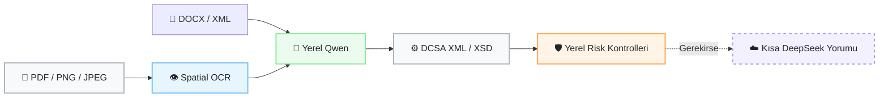

# [CerberusVision](https://github.com/mecik-arda/CerberusVision)

[](https://learn.microsoft.com/windows/wsl/)

> Bu proje, Soft İş Çözümleri bünyesinde hazırlanmış bir staj projesidir.
>
> **Oluşturulma Tarihi:** 17.07.2026
>
> **WSL-native:** Kaynak kod, Git işlemleri, Python ortamı, modeller ve sunucu
> doğrudan Ubuntu dosya sistemi içinde çalışır; Windows tarafında ikinci bir
> kaynak kopyası veya dosya senkronizasyonu gerekmez.

CerberusVision, konşimento talimatı (Shipping Instruction) belgelerini yerel
çıkarım hattı ve Qwen modeliyle işleyip DCSA tabanlı XML üreten bir FastAPI
uygulamasıdır. PDF, DOCX, XML, PNG ve JPEG desteklenir; arayüz tek seçimde en
fazla 10 belgeyi GPU dostu sıralı kuyrukla işler. Ana ve tek çalışma ortamı
WSL2/Ubuntu'dur; DeepSeek yalnızca isteğe bağlı, kısa ve salt-okunur bir risk
hakemi olarak kullanılır.



DeepSeek belge verisini düzeltmez, alan doldurmaz ve ikinci bir Shipping
Instruction üretmez. Nihai JSON/XML her zaman yerel model çıktısından üretilir.

## Doğrulanmış çalışma ortamı

- WSL2 dağıtımı: `Ubuntu` (Ubuntu 26.04 LTS)
- Tek kaynak ve çalışma dizini: `~/projects/CerberusVision`
- Python: `3.12.13` (`uv` tarafından yönetilir)
- OpenVINO / OpenVINO GenAI: `2025.4`
- GPU: Intel Arc 140V iGPU; OpenVINO aygıtları `CPU`, `GPU`
- Test sonucu: `135 passed` (Ubuntu WSL2)

Kod düzenleme, Git işlemleri, testler ve sunucu doğrudan WSL ext4 dosya sistemi
içinde yürütülür. Windows tarafında ikinci bir kaynak kopya veya senkronizasyon
adımı kullanılmaz.

## Arayüz dili ve tema

Web arayüzü varsayılan olarak Türkçe açılır. Üst menüdeki `TR / EN`
seçicisinden İngilizceye geçilebilir. Dil tercihi tarayıcıda saklanır ve sonraki
açılışlarda korunur; yükleme, işlem durumu, denetim, doğrulama ve dinamik tablo
mesajları da seçilen dile uyarlanır.

Belge yüklenmeden önce belge dili ve XML içerik dili ayrı ayrı `Türkçe` veya
`İngilizce` seçilir. Belge dili PaddleOCR profilini ve Qwen'in kaynak etiketleri
yorumlama biçimini belirler. XML içerik dili yalnızca açıklama ve not gibi
çevrilebilir değerleri yönlendirir; şirket adları, adresler, limanlar, kimlikler,
kodlar ve sayılar değiştirilmez. DCSA XML eleman adları XSD uyumluluğu için her
zaman standart biçiminde kalır.

Ay simgeli tema düğmesi açık ve koyu tema arasında geçiş yapar. İlk açılışta
işletim sistemi tercihi kullanılır; kullanıcı bir tema seçtiğinde bu tercih kalıcı
hale gelir.

Yükleme alanı PDF, DOCX, XML, PNG ve JPEG dosyalarını çoklu seçime veya
sürükle-bırak işlemine kabul eder. Dosya uzantısına ek olarak PDF/PNG/JPEG imzası,
DOCX paket yapısı ve güvenli XML ayrıştırması sunucuda doğrulanır. PDF ve görseller
OCR'a, DOCX/XML metni doğrudan yerel modele gider. Kuyruk belgeleri sırayla
işlediği için tek GPU üzerinde eşzamanlı model yükü oluşturmaz; her dosyanın durumu
arayüzde ayrı gösterilir.

Üst menüdeki arama düğmesi form alanlarını ve ana bölümleri bulup ilgili
kontrole odaklanır. Bildirim paneli son işlem durumunu, profil paneli ise etkin dil,
tema ve oturum kimliğini gösterir. PDF araç çubuğu; oturumluk belge bağlantısı
kopyalama, `%100 / %125 / %150 / %200` yakınlaştırma, tam ekran, sayfa sayımı,
sayfa düğmeleri ve önceki/sonraki gezinme işlevlerini sunar. Sonuç eylemleri,
gerekli veri oluşana kadar açıkça devre dışı tutulur.

Arama simgesinin yanındaki ayarlar paneli etkin yerel model, OpenVINO aygıtı,
azami çıktı token sayısı ve KV-cache bilgisini gösterir. Panel; proje `models/`
dizini, `~/models`, Hugging Face önbelleği ve Ollama manifestlerinde bulunan WSL
modellerini listeler ve etkin modeli işaretler. Cerberus sunucu API anahtarı yalnızca
tarayıcı sekmesinin `sessionStorage` alanında, DeepSeek anahtarı ise yalnızca çalışan
FastAPI sürecinin belleğinde tutulur. DeepSeek denetim modu ve risk eşiği aynı
panelden çalışma zamanında değiştirilebilir; anahtar hiçbir API yanıtında geri
döndürülmez.

Tailwind sınıfları geliştirme sırasında derlenip `static/app.css` içinde tutulur.
Arayüz çalışma zamanında Tailwind CDN veya Google Fonts bağlantısı kurmaz. CSS'i
yeniden üretmek için Node.js bulunan geliştirme ortamında `pnpm install` ve
`pnpm run build:css` komutları kullanılabilir.

## İngilizce belge keşif aracı

`scripts/find_shipping_documents.py`, Shipping Instruction ve Bill of Lading
örneklerini hedefli İngilizce sorgularla arar. Resmî Brave Search API ana sağlayıcıdır;
mevcut müşteriler için Google Custom Search JSON API de desteklenir. Google sonuç
sayfalarının HTML'i kazınmaz. Varsayılan sorgular PDF, PNG ve JPG belgelerde
`shipping instruction`, `bill of lading`, liman, konteyner, navlun, brüt ağırlık ve
HS code terimlerine odaklanır.

[Google'ın resmî duyurusuna](https://developers.google.com/custom-search/v1/overview)
göre Custom Search JSON API yeni müşterilere kapalıdır ve mevcut müşteriler için
1 Ocak 2027'de sonlandırılacaktır. Bu nedenle yeni kurulumlarda
[Brave Search API](https://api-dashboard.search.brave.com/app/documentation/web-search/get-started)
önerilir; Google sağlayıcısı geçiş dönemi uyumluluğu için korunur.

Yerel hat dosya imzasını, boyutu, okunabilirliği, belge geometrisini, anahtar kelime
kapsamını ve ilk İngilizce sinyalini denetler. DeepSeek yalnızca iki karar verir:
belgenin Shipping Instruction/Bill of Lading konusuyla ilgili olup olmadığı ve
İngilizce olup olmadığı. Kalite skoru vermez; metni düzeltmez, alan çıkarmaz,
tamamlamaz veya yeni veri üretmez. Her iki DeepSeek kararı da olumlu olmayan belge
`accepted` dizinine alınmaz.

WSL içindeki `.env` için önerilen ayar:

```dotenv
DOCUMENT_SEARCH_PROVIDER=brave
BRAVE_SEARCH_API_KEY=
DEEPSEEK_API_KEY=
DOCUMENT_SEARCH_OUTPUT_DIR=veriler/discovered
```

Google Custom Search JSON API erişimi bulunan mevcut hesaplar için:

```dotenv
DOCUMENT_SEARCH_PROVIDER=google
GOOGLE_SEARCH_API_KEY=
GOOGLE_SEARCH_ENGINE_ID=
```

Kullanım:

```bash
cd ~/projects/CerberusVision
./.venv/bin/python scripts/find_shipping_documents.py --print-queries
./.venv/bin/python scripts/find_shipping_documents.py --max-results 20
./.venv/bin/python scripts/find_shipping_documents.py --local-only --max-results 20
./.venv/bin/python scripts/find_shipping_documents.py \
  --query 'filetype:pdf "bill of lading" "port of loading" "port of discharge"'
```

Normal çalışmada kabul edilen dosyalar `veriler/discovered/accepted`, denetim izi
`veriler/discovered/manifest.jsonl` altına yazılır. `--local-only` DeepSeek'i hiç
çağırmaz ve yerel filtreden geçenleri `pending_review` altında bekletir; bu dosyalar
kabul edilmiş veri sayılmaz. Kaynak adresi ve SHA-256 özeti manifestte tutulur,
aynı içerik yeniden indirilmez. Üçüncü taraf belgelerin kullanım/lisans hakkı arama
sonucuyla birlikte verilmiş sayılmaz; veri kümesine almadan önce kaynak koşulları
kontrol edilmelidir.

## Model profilleri

| Profil | Model | Aygıt | Kullanım |
|---|---|---|---|
| `gpu` (varsayılan) | Qwen2.5-7B-Instruct INT4 OpenVINO | Arc 140V GPU | Hızlı günlük işleme |
| `quality` / `14b` | Qwen2.5-14B-Instruct INT4 OpenVINO | CPU | Opsiyonel daha büyük yerel model |

Profiller aynı anda yüklenmez. 7B GPU profili ana modeldir; 14B modeli silinmeden
opsiyonel CPU profili olarak tutulur.

Arc 140V üzerinde 14B model dosyası yaklaşık 7.9 GiB'dir. WSL/OpenVINO GPU
derlemesinde bu ağırlıklar USM grafik bellek havuzunu doldurduğu için ek çalışma
tamponu ayrılamamıştır. WSL RAM'i 24 GiB'ye yükseltildiğinde dahi süreç yaklaşık
9.54 GiB RSS'de GPU USM tahsis hatası vermiştir; dolayısıyla sorun normal WSL RAM
tükenmesi değildir. Aynı model CPU'da, 4.2 GiB büyüklüğündeki 7B profil ise GPU'da
başarıyla çalışır.

Örnek PDF ile yapılan gerçek denetimde 7B GPU hattı yaklaşık 74–81 saniyede,
14B CPU hattı yaklaşık 10 dakikada tamamlanmıştır. Son sıkılaştırılmış 7B sonucu;
konteyner, brüt/net ağırlık, hacim, liman ve taraf şehirlerini 14B sonucu ile aynı
kritik değerlere eşleştirmiştir. Model çıktıları yine de insan onayından geçmelidir.

## İlk WSL2 kurulumu

### 1. WSL bellek profilini uygula

Projedeki [`.wslconfig.example`](.wslconfig.example) dosyası 32 GiB RAM'li bu
makine için WSL'ye 24 GiB RAM ve 8 GiB swap ayırır. Ayar tüm WSL2 dağıtımlarını
etkiler.

PowerShell:

```powershell
Copy-Item .wslconfig.example $env:USERPROFILE\.wslconfig
wsl --shutdown
```

Bu dosyanın biçimi ve varsayılanlar için Microsoft'un
[WSL gelişmiş ayarlar belgesine](https://learn.microsoft.com/windows/wsl/wsl-config)
bakılabilir.

### 2. Projeyi WSL dosya sistemine klonla

Ubuntu terminali:

```bash
mkdir -p ~/projects
git clone https://github.com/mecik-arda/CerberusVision.git ~/projects/CerberusVision
cd ~/projects/CerberusVision
```

Mevcut kurulum zaten `~/projects/CerberusVision` altındaysa yeniden
klonlama gerekmez. `./scripts/wsl_sync.sh` artık Windows'tan dosya kopyalamaz;
yalnızca geçerli dizinin WSL2 içinde, Linux home altında ve Git geçmişiyle birlikte
çalıştığını doğrular.

### 3. VS Code'u WSL penceresinde aç

Ubuntu terminalinde proje dizininden:

```bash
code .
```

VS Code'un sol alt köşesinde `WSL: Ubuntu` görünmelidir. İlk kullanımda Windows
tarafındaki VS Code'a
[WSL uzantısını](https://marketplace.visualstudio.com/items?itemName=ms-vscode-remote.remote-wsl)
kurun. Windows klasörünü ayrı bir çalışma alanı olarak açmayın; terminal, Git,
Python ve eklentiler WSL penceresinde çalışmalıdır.

### 4. Python ve bağımlılıkları kur

```bash
cd ~/projects/CerberusVision
./scripts/wsl_setup.sh
```

Betik kullanıcı hesabına sabitlenmiş `uv 0.11.28` ve yönetilen Python 3.12 kurar;
sistem Python'una ve `apt` paketlerine dokunmaz. Tekrar çalıştırılabilir ve mevcut
`.venv` ortamını koruyarak bağımlılıkları günceller.

### 5. Varsayılan GPU modelini indir

```bash
./scripts/wsl_model_setup.sh
```

Varsayılan depo
[`OpenVINO/Qwen2.5-7B-Instruct-int4-ov`](https://huggingface.co/OpenVINO/Qwen2.5-7B-Instruct-int4-ov)
ve hedef `models/Qwen-2.5-7B-Instruct-INT4` dizinidir.

Opsiyonel 14B CPU modelini kurmak için:

```bash
QWEN_MODEL_ID='OpenVINO/Qwen2.5-14B-Instruct-int4-ov' \
QWEN_MODEL_PATH="$PWD/models/Qwen-2.5-14B-Instruct-INT4" \
./scripts/wsl_model_setup.sh
```

Hazır OpenVINO 14B modelinin kaynağı:
[`OpenVINO/Qwen2.5-14B-Instruct-int4-ov`](https://huggingface.co/OpenVINO/Qwen2.5-14B-Instruct-int4-ov).

### 6. Model profilini seç

```bash
./scripts/wsl_profile.sh gpu      # 7B + GPU (varsayılan)
./scripts/wsl_profile.sh quality  # 14B + CPU
./scripts/wsl_profile.sh show     # etkin yolu ve aygıtı göster
```

Profil değişikliğinden sonra çalışan sunucuyu yeniden başlatın.

## Çalıştırma

```bash
cd ~/projects/CerberusVision
./scripts/wsl_run.sh
```

Tarayıcı: `http://localhost:8000`

Sunucu `.env` dosyasını yükler ve varsayılan olarak yalnızca
`127.0.0.1:8000` üzerinde çalışır. Portu geçici değiştirmek için:

```bash
CERBERUS_PORT=8080 ./scripts/wsl_run.sh
```

Uzak ağ erişimi gerekiyorsa güçlü bir API anahtarı zorunludur:

```dotenv
CERBERUS_HOST=0.0.0.0
CERBERUS_API_KEY=uzun-rastgele-bir-deger
```

`wsl_run.sh`, loopback dışı adreste anahtar olmadan başlamayı reddeder. Web
arayüzü API HTTP 401 döndürdüğünde anahtarı ister ve yalnızca geçerli tarayıcı
sekmesinin `sessionStorage` alanında tutar. API istemcileri
`Authorization: Bearer <anahtar>` veya `X-Cerberus-Api-Key` başlığını kullanabilir.
Yüklemeler IP başına kayan zaman penceresiyle ve eşzamanlı aktif işlem kotasıyla
sınırlanır.

## Doğrulama komutları

```bash
# Otomatik testler
./.venv/bin/python -m pytest -q

# Paket ve OpenVINO aygıt kontrolü
./.venv/bin/python scripts/wsl_smoke.py --require-model

# Modeli gerçekten yükle ve kısa token üret
./.venv/bin/python scripts/wsl_smoke.py --require-model --probe-model

# Gerçek PDF OCR denetimi
./.venv/bin/python scripts/wsl_smoke.py --pdf konsimentotalimatornek3s.pdf

# FastAPI readiness ve tam PDF/SSE işlem hattı
./scripts/wsl_api_smoke.sh --require-ready --pdf konsimentotalimatornek3s.pdf

# GPU özellikleri ve bellek sınırları
./.venv/bin/python scripts/wsl_gpu_info.py
```

`/health`, model yolu ve seçili OpenVINO aygıtı hazırsa HTTP 200; eksikse ayrıntılı
kontrol raporuyla HTTP 503 döndürür.

## DeepSeek kısa risk denetimi

Varsayılan mod `risk`, eşik `30`'dur. Önce ücretsiz yerel kontroller çalışır.
DeepSeek'e tam OCR veya tam JSON gönderilmez; yalnızca bulgular, ilgili kritik
değerler ve en fazla 2500 karakterlik seçilmiş OCR satırları gönderilir.

`.env`:

```dotenv
DEEPSEEK_API_KEY=
DEEPSEEK_BASE_URL=https://api.deepseek.com
DEEPSEEK_REVIEW_MODE=risk
DEEPSEEK_RISK_THRESHOLD=30
DEEPSEEK_MAX_OCR_EXCERPT_CHARS=2500
```

Modlar:

- `off`: Bulut denetimi tamamen kapalıdır.
- `manual`: Yalnızca kullanıcı endpoint/CLI seçeneğiyle çalışır.
- `risk`: Yerel risk eşik veya üstündeyse otomatik çalışır.
- `always`: Her belgede kısa denetim çalışır.

DeepSeek hatası yerel JSON/XML üretimini durdurmaz. Kullanıcı formu değiştirdiğinde
eski bulut skoru geçersizleştirilir ve yeni veri otomatik olarak buluta gönderilmez.

Audit CLI:

```bash
# Yerel model + yerel risk politikası
./.venv/bin/python scripts/api_compare.py \
  --ocr-text logs/SESSION_ID/ocr_layout_text.txt

# Açıkça tek seferlik kısa bulut yorumu iste
./.venv/bin/python scripts/api_compare.py \
  --pdf uploads/sample.pdf --cloud-review --output audit_report.json
```

## Ortam değişkenleri

| Değişken | WSL varsayılanı | Açıklama |
|---|---|---|
| `QWEN_MODEL_PATH` | `.../Qwen-2.5-7B-Instruct-INT4` | Etkin OpenVINO model dizini |
| `OPENVINO_DEVICE` | `GPU` | `GPU` veya `CPU` |
| `OPENVINO_CACHE_DIR` | `.openvino_cache` | Derlenmiş OpenVINO önbelleği |
| `OPENVINO_KV_CACHE_PRECISION` | `u8` | Daha düşük KV-cache bellek kullanımı |
| `SSE_TIMEOUT_SECONDS` | `1800` | Uzun yerel çıkarım için SSE bekleme süresi |
| `CERBERUS_HOST` | `127.0.0.1` | Uvicorn dinleme adresi |
| `CERBERUS_API_KEY` | boş | Loopback dışı erişimde zorunlu Bearer/API anahtarı |
| `UPLOAD_RATE_LIMIT` | `5` | Zaman penceresinde IP başına yükleme sınırı |
| `UPLOAD_RATE_WINDOW_SECONDS` | `60` | Yükleme hız sınırı penceresi |
| `MAX_ACTIVE_PIPELINES` | `2` | Aynı anda kabul edilen işlem hattı sayısı |
| `STREAM_QUEUE_MAX_SIZE` | `20` | Bellekte tutulabilecek SSE kuyruğu üst sınırı |
| `STREAM_QUEUE_TTL_SECONDS` | `300` | Bağlanılmayan tamamlanmış SSE kuyruğu ömrü |
| `LOG_RETENTION_DAYS` | `30` | Audit oturumlarının otomatik saklama süresi |
| `OCR_LANG` | `en` | PaddleOCR dil profili; belge kümesine göre değiştirilebilir |
| `DEEPSEEK_API_KEY` | boş | Opsiyonel kısa bulut denetimi |
| `DEEPSEEK_REVIEW_MODE` | `risk` | `off`, `manual`, `risk`, `always` |
| `DEEPSEEK_RISK_THRESHOLD` | `30` | Otomatik kısa denetim eşiği |
| `DEEPSEEK_MAX_OCR_EXCERPT_CHARS` | `2500` | Seçilmiş OCR metni üst sınırı |
| `DOCUMENT_SEARCH_PROVIDER` | `auto` | `brave`, mevcut hesaplar için `google` veya otomatik seçim |
| `BRAVE_SEARCH_API_KEY` | boş | Brave Search API anahtarı |
| `GOOGLE_SEARCH_API_KEY` | boş | Mevcut Google Custom Search JSON API anahtarı |
| `GOOGLE_SEARCH_ENGINE_ID` | boş | Google Programmable Search Engine kimliği |
| `DOCUMENT_SEARCH_OUTPUT_DIR` | `veriler/discovered` | Kabul, bekleme ve manifest çıktı kökü |
| `DOCUMENT_SEARCH_MAX_RESULTS` | `20` | Bir çalıştırmada incelenecek azami aday |

## API

| Method | Path | Açıklama |
|---|---|---|
| `POST` | `/api/upload` | En fazla 50 MB PDF/DOCX/XML/PNG/JPEG yükler ve session ID döndürür |
| `POST` | `/api/upload-and-stream` | Desteklenen belgeyi yükler ve SSE durum akışını başlatır |
| `GET` | `/api/runtime-settings` | Model, aygıt, WSL model keşfi ve güvenli yapılandırma durumunu döndürür |
| `PUT` | `/api/runtime-settings` | DeepSeek anahtarı, denetim modu ve risk eşiğini süreç belleğinde günceller |
| `GET` | `/api/stream/{session_id}` | SSE işlem durumları |
| `GET` | `/api/status/{session_id}` | Son işlem durumu |
| `PUT` | `/api/sessions/{session_id}/draft` | Düzenlenmiş taslağı ve XML'i kaydeder |
| `POST` | `/api/sessions/{session_id}/approve` | Zorunlu alan/XSD kontrolü sonrası onaylar |
| `POST` | `/api/sessions/{session_id}/cloud-review` | Tek seferlik kısa DeepSeek yorumu |
| `GET` | `/health` | Bağımlılık, model ve OpenVINO readiness raporu |

`/api/upload` ve `/api/upload-and-stream` multipart istekleri `file` yanında
`document_language=tr|en` ve `output_language=tr|en` alanlarını kabul eder. API
istemcileri bu alanları göndermezse geriye uyumluluk için `en` kullanılır.
Arayüz çoklu seçimleri bu endpoint'e sıralı istekler olarak gönderir; böylece her
belge bağımsız session, audit izi ve XML sonucuna sahip olur ve yerel GPU çıkarımı
aynı anda birden çok belgeyle zorlanmaz.

## Audit kayıtları

Her işlem `logs/<session_id>/` altında OCR metni/kutuları, yerel model çıktısı,
XML, XSD doğrulama raporu, yerel/bulut risk raporu ve işlem özetini saklar.
Oturum biçimine uyan ve `LOG_RETENTION_DAYS` süresini aşan dizinler günde en fazla
bir kez güvenli biçimde temizlenir. `logs/`, `uploads/`, `models/`, `.env` ve
OpenVINO önbelleği Git'e eklenmez.

## Proje yapısı

```text
app/
  document_ingestion.py  Format/imza doğrulama ve DOCX/XML metin çıkarımı
  security.py           Opsiyonel API anahtarı ve kayan pencere yükleme limiti
  llm/                 Yerel Qwen, yerel risk ve kısa DeepSeek hakemi
  llm/document_relevance.py  Keşif için yalnızca konu ve İngilizce filtresi
  ocr/                 PaddleOCR ve uzamsal satır gruplama
  utils/model_discovery.py  WSL içindeki bilinen yerel model depolarını tarar
  routes/              Upload, SSE, taslak, onay ve cloud-review API'leri
  search/              Resmî arama API'leri, güvenli indirme ve yerel ön eleme
  xml/                 DCSA XML dönüştürme ve XSD doğrulama
scripts/
  find_shipping_documents.py  İngilizce örnek belge keşif CLI'ı
  wsl_sync.sh          WSL-native kaynak/Git çalışma dizimini doğrular
  wsl_setup.sh         uv, Python ve bağımlılık kurulumu
  wsl_model_setup.sh   OpenVINO modelini indirir
  wsl_profile.sh       7B GPU / 14B CPU profilini seçer
  wsl_run.sh           FastAPI sunucusunu başlatır
  wsl_smoke.py         Bağımlılık, OCR ve model probu
  wsl_api_smoke.sh     Readiness ve tam HTTP/SSE denetimi
  wsl_gpu_info.py      OpenVINO GPU özellik raporu
static/
  app.css              Yerel, minify edilmiş Tailwind çıktısı
tests/                 135 otomatik regresyon testi
```

## Lisans

MIT License. Ayrıntılar için `LICENSE` dosyasına bakın.
